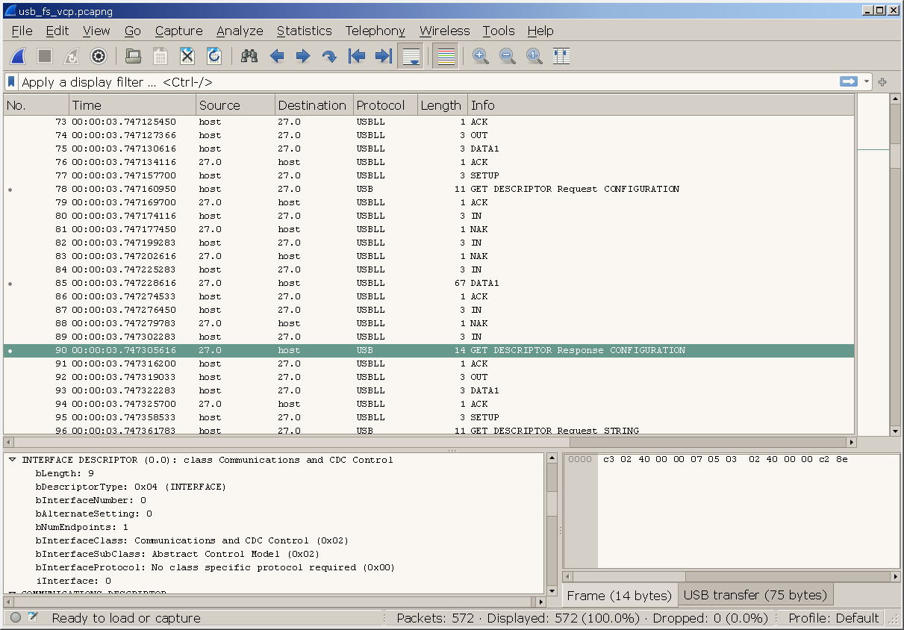
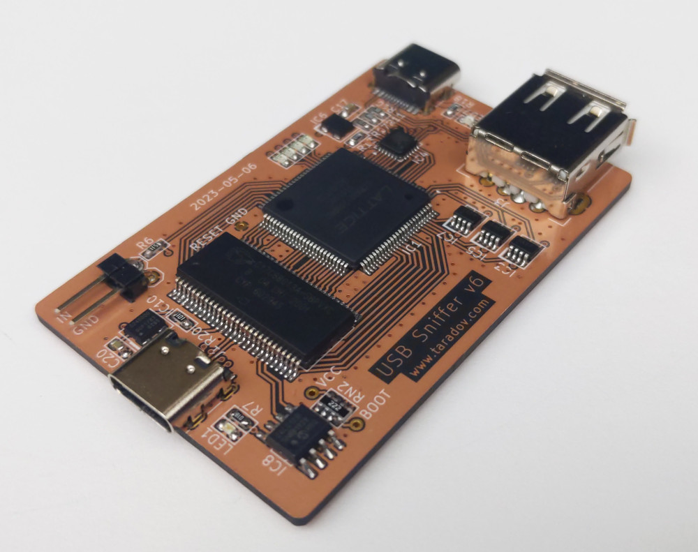
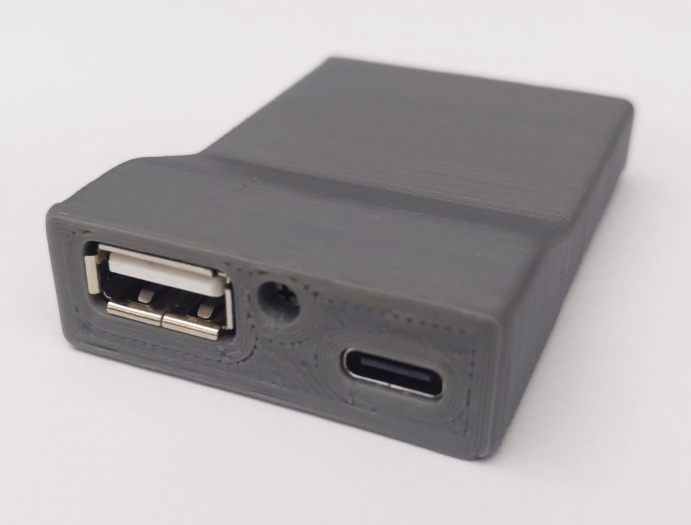

# Low-cost USB Sniffer (LS/FS/HS) with Wireshark interface

This sniffer can be used standalone from a command line or as a plugin for
[Wireshark](https://www.wireshark.org/) with direct control from the UI.

Either way, the capture is saved in a standard [PcapNG](https://pcapng.com/) format.



Here are some example capture files:

 * [Mouse (Low-Speed)](doc/usb_ls_mouse.pcapng)
 * [Virtual COM-Port Adapter (Full-Speed)](doc/usb_fs_vcp.pcapng)
 * [USB Flash Drive (High-Speed)](doc/usb_hs_flash_drive.pcapng)

Note: You will need a recent version of Wireshark (v4.x.x). Older versions may
not be able to decode USB payload, but should still show the raw data.

## Hardware

The sniffer is based around Cypress CY7C68013A MCU, Lattice LCMXO2 FPGA, and
Microchip USB3343 USB PHY.

Prices and availability of ICs vary, but the total BOM should be less than $50.

LCMXO2-2000HC speed grades 5 and 6 were tested and the provided JED file was built
for the speed grade 5, so it should work for both. Speed grade 4 is too slow and
does not meet timing requirements.

Caution: Do not buy CY7C68013A from eBay or AliExpress, they all are either fake
or sketchy in some way. This IC can be quite expensive from regular suppliers,
but [LCSC](https://www.lcsc.com/) is a legitimate supplier and they often have
it at much cheaper prices.

PCBs can be ordered from [OSH Park](https://oshpark.com/shared_projects/avWPFMNs)
or any other PCB manufacturer, [gerber files](bin/usb-sniffer-gerbers.zip) are provided.

There are also STL files for the case.

 

## Hardware bring up

This hardware does not require external programmers, both MCU and FPGA are programmed
using a USB interface.

When a board with a blank EEPROM is connected, it would enumerate as an unconfigured
FX2LP device.

Note: on Windows blank FX2LP will enumerate as an unknown USB device. Use supplied
dummy [INF file](bin/blank_fx2lp.inf) as a driver. It will associate blank FX2LP device
with a generic WinUSB driver, so it would be recognized by the tools. Once the firmware
runs, it would supply necessary descripptors automatically.

The first step is to load the firmware into the MCU SRAM:
```
./usb_sniffer --mcu-sram usb_sniffer.bin
```

The device would reset and enumerate as a USB Sniffer with a dummy serial number. After that,
program the EEPROM:
```
./usb_sniffer --mcu-eeprom usb_sniffer.bin
```

After resetting or power cycling, the device would enumerate as a USB Sniffer with a
real serial number. The serial number is derived from the FPGA unique identifier,
so if this step succeeds, it means that FPGA is also functional.

After that program the FPGA flash:
```
./usb_sniffer --fpga-flash usb_sniffer_impl.jed
```

MCU EEPROM can be reprogrammed at any time as long as it is running valid firmware.

In case the firmware gets corrupted, it is possible to run the MCU in the unconfigured
mode by shorting BOOT and VCC test points (located near the EEPROM IC on the board) and
resetting the device. You would need to repeat both steps for programming the MCU
firmware to recover it to the working state.

The functionality and performance of the MCU and FPGA connection can be tested using
the following command:
```
./usb_sniffer --test
```
You should be getting 40-50 MB/s. If the speed is significantly slower, connect the
sniffer directly into the root USB port without intermediate hubs.

It is a good idea to run this test after each work session.

## Installation

Pre-built binaries are provided for [Linux](bin/usb_sniffer_linux) and
[Windows](usb_sniffer_win.exe).

To use with Wireshark, copy the file into the extcap plugin directory:
`~/.config/wireshark/extcap` on Linux, and
`C:/Users/<user>/AppData/Roaming/Wireshark/extcap/` on Windows.

For Linux, make sure that the binary file has an executable attribute set.

After that, refresh the list of interfaced in Wireshark and you should see
"USB Sniffer" as one of the interfaces. Configure capture settings and start/stop
the capture as with any other interface.

