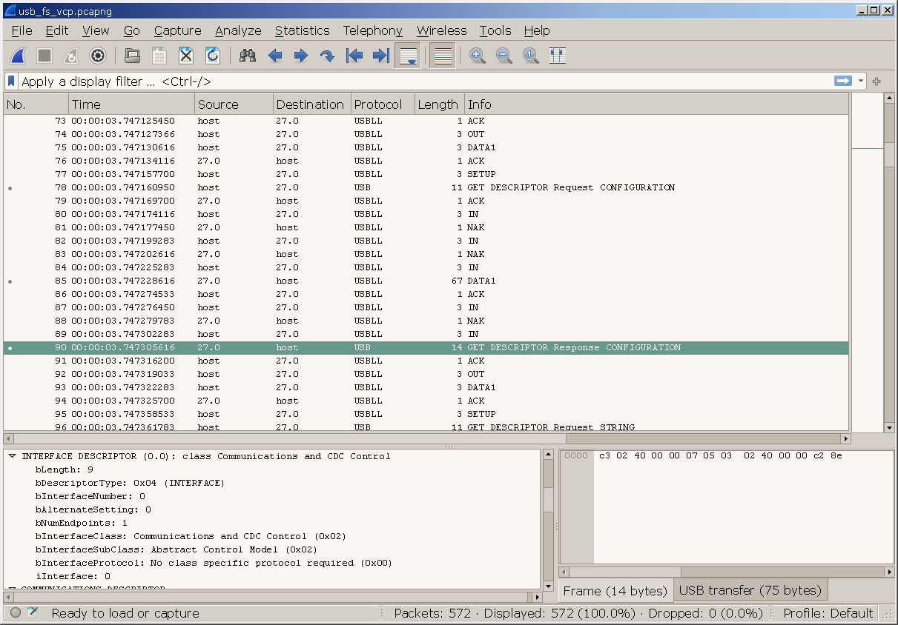
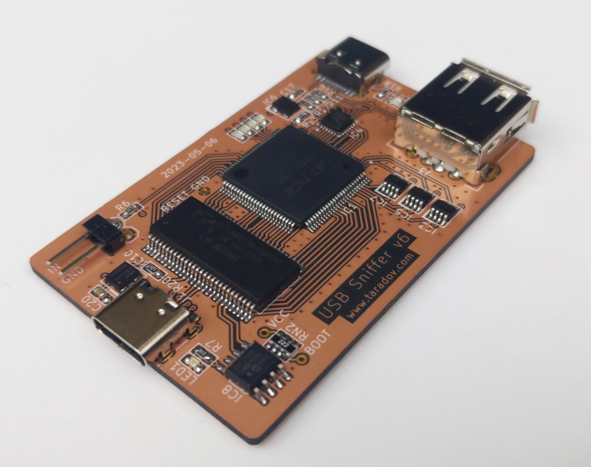
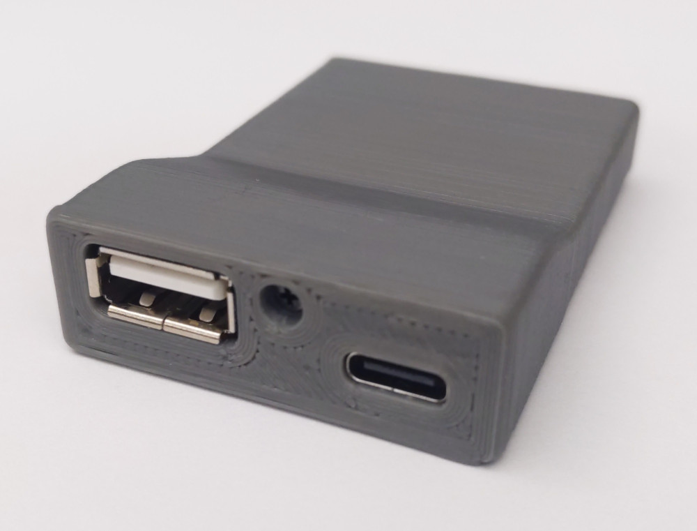
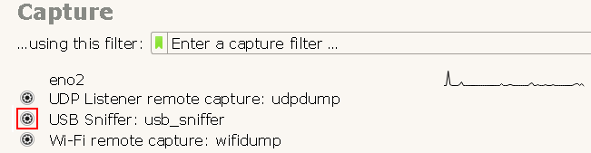
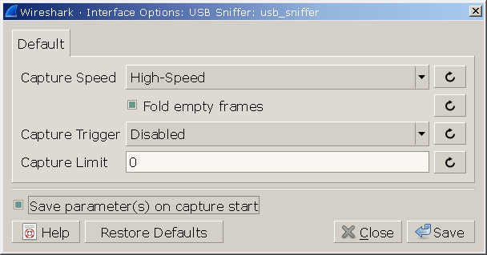

# Low-Cost USB Sniffer (LS/FS/HS) with Wireshark Interface

This sniffer can be used as a standalone command-line tool or as a plugin for
[Wireshark](https://www.wireshark.org/) with direct control from the UI. In both
cases, captures are saved in the standard [PcapNG](https://pcapng.com/) format.



Example capture files:

- [Mouse (Low-Speed)](doc/usb_ls_mouse.pcapng)
- [Virtual COM-Port Adapter (Full-Speed)](doc/usb_fs_vcp.pcapng)
- [USB Flash Drive (High-Speed)](doc/usb_hs_flash_drive.pcapng)

> **Note:** A recent version of Wireshark (v4.x.x) is required. Older versions
> may not be able to decode USB payloads, but should still show the raw data.

## Hardware

The sniffer is based around Cypress CY7C68013A MCU, Lattice LCMXO2 FPGA, and
Microchip USB3343 USB PHY.

Prices and availability of ICs vary, but the total BOM should be less than $50.

LCMXO2-2000HC speed grades 5 and 6 were tested. The provided JED file was built
for speed grade 5, so it should work for both. Speed grade 4 is too slow and does
not meet timing requirements.

> **Caution:** Do not buy CY7C68013A from eBay or AliExpress; they are either fake
> or otherwise questionable. This IC can be quite expensive from regular
> suppliers, but [LCSC](https://www.lcsc.com/) is a legitimate supplier and often
> has it at much lower prices.

PCBs can be ordered from [OSH Park](https://oshpark.com/shared_projects/avWPFMNs)
or any other PCB manufacturer, [gerber files](bin/usb-sniffer-gerbers.zip) are provided.

There are also STL files for the case.

 

## Hardware Bring-Up

This hardware does not require external programmers. Both the MCU and FPGA are
programmed using a USB interface.

When a board with a blank EEPROM is connected, it would enumerate as an unconfigured
FX2LP device.

> **Windows:** A blank FX2LP will enumerate as an unknown USB device. Use the
> supplied dummy [INF file](bin/blank_fx2lp.inf) as a driver. It associates the
> blank FX2LP device with a generic WinUSB driver so that it is recognized by the
> tools. Once the firmware runs, it supplies the necessary descriptors automatically.

> **Linux:** Copy [90-usb-sniffer.rules](bin/90-usb-sniffer.rules) to
> `/etc/udev/rules.d` to allow a regular user to access the device.

The first step is to load the firmware into the MCU SRAM:

```console
./usb_sniffer --mcu-sram usb_sniffer.bin
```

The device will reset and enumerate as a USB Sniffer with a dummy serial number.
After that, program the EEPROM:

```console
./usb_sniffer --mcu-eeprom usb_sniffer.bin
```

After resetting or power cycling, the device will enumerate as a USB Sniffer with
a real serial number. The serial number is derived from the FPGA unique identifier,
so if this step succeeds, the FPGA is also functional.

Then program the FPGA flash:

```console
./usb_sniffer --fpga-flash usb_sniffer_impl.jed
```

MCU EEPROM can be reprogrammed at any time as long as it is running valid firmware.

In case the firmware gets corrupted, it is possible to run the MCU in the unconfigured
mode by shorting BOOT and VCC test points (located near the EEPROM IC on the board) and
resetting the device. You would need to repeat both steps for programming the MCU
firmware to recover it to the working state.

The functionality and performance of the MCU and FPGA connection can be tested using
the following command:

```console
./usb_sniffer --test
```

You should be getting 40-50 MB/s. If the speed is significantly slower, connect the
sniffer directly into the root USB port without intermediate hubs.

It is a good idea to run this test after significant changes to the hardware setup.

## Installation

Pre-built binaries are provided for [Linux](bin/usb_sniffer_linux) and
[Windows](bin/usb_sniffer_win.exe). Windows users can alternatively run the
[Wireshark plugin installer](bin/USB-Sniffer-Wireshark-Plugin-Setup.exe).

To use with Wireshark, copy the file into the extcap plugin directory. Typical
locations are `~/.local/lib/wireshark/extcap` on Linux, and
`C:/Users/<user>/AppData/Roaming/Wireshark/extcap/` on Windows. The exact location is
provided in the `Help -> About Wireshark -> Folders -> Personal Extcap path`.

On Linux, make sure that the binary file has its executable attribute set.

## Usage

After installation, refresh the list of interfaces in Wireshark. You should see
"USB Sniffer" as one of the interfaces:



The settings icon next to the interface name (highlighted in red) will bring up
the settings dialog:



Here you can configure the capture speed, empty frame folding, trigger type and limit
the number of the captured packets (0 for unlimited). Auto-detect is the default:
the FPGA detects Low-, Full- or High-Speed signaling and the extcap program writes
each packet to a speed-specific PCAPNG interface. Manual speed selection remains
available for malformed devices or captures that begin after High-Speed negotiation.

After the interface is configured, start and stop the capture as with any other
interface.

## Windows Build and Test

The Windows host utility requires MinGW-w64 GCC, pkg-config and libusb. The FX2LP
firmware requires SDCC. This repository's Windows regression script expects the
portable SDCC installation under `tools/sdcc-4.6.0`. Install it without modifying
the system toolchain using:

```powershell
.\scripts\install-sdcc.ps1
```

The regression script builds/tests all components that can be verified without
Lattice Diamond:

```powershell
.\tests\run.ps1
```

Build the host executable from an MSYS2/MinGW environment with:

```powershell
$env:Path = 'C:\msys64\mingw64\bin;C:\msys64\usr\bin;' + $env:Path
Push-Location software
make clean
make
Pop-Location
```

Create the Windows Wireshark extcap installer after building the host executable:

```powershell
.\installer\build.ps1
```

The installer is written to `dist\USB-Sniffer-Wireshark-Plugin-Setup.exe`.

## FPGA Build Without a Lattice Account

The FPGA can be built with Yosys, Project Trellis and nextpnr. The regular OSS
CAD Suite binary omits the MachXO2-2000 chip database, so first build the small
device-specific WSL tool once:

```powershell
.\scripts\build-nextpnr-machxo2-2000-wsl.ps1
```

Install/extract OSS CAD Suite under `tools\oss-cad-suite\oss-cad-suite`, then
build the FPGA image:

```powershell
.\scripts\build-fpga-oss.ps1
```

The output is `bin\usb_sniffer_impl.bit`. Test it without changing FPGA flash:

```powershell
.\software\usb_sniffer.exe --fpga-sram .\bin\usb_sniffer_impl.bit
```

The open-source flow currently produces an SRAM BIT image, not the JED image
accepted by this project's permanent flash programmer. Power cycling restores
the image already stored in FPGA flash. A permanent update still requires a
Diamond-generated JED file.

